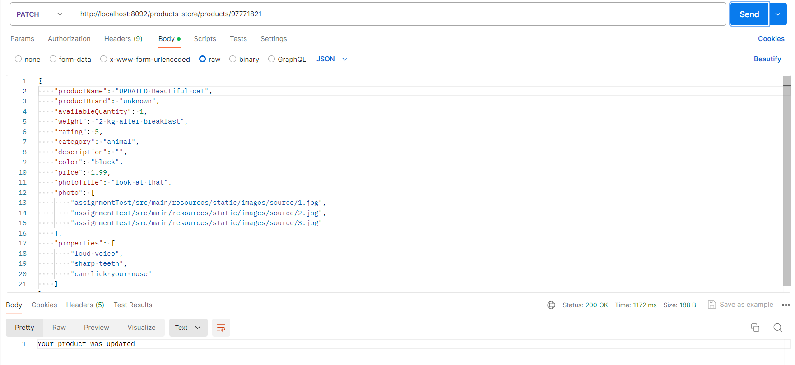

Данное CRUD приложение работает по следующим url:

- localhost:8092/products-store/products
  Get метод. Запрос по данному адресу выдает список всех продуктов в формате JSON;

- localhost:8092/products-store/products/{id}*
  {id}* - id продукта
  Get метод. Запрос по данному адресу выдает продукт по заданному id в формате JSON.

- localhost:8092/products-store/products
  Post  метод.  Запрос  по  данному  адресу добавляет продукт, добавление в формате JSON. В случае успешного добавления, 
  следует ответ: "Your product was added", статус - HttpStatus.OK
  Пример запроса:
  {
    "productName": "Beautiful cat",
    "productBrand": "unknown",
    "availableQuantity": 1,
    "weight": "2 kg after breakfast",
    "rating": 5,
    "category": "animal",
    "description": "",
    "color": "black",
    "price": 1.99,
    "photoTitle": "look at that",
    "photo": [
               "assignmentTest/src/main/resources/static/images/source/1.jpg",
               "assignmentTest/src/main/resources/static/images/source/2.jpg",
               "assignmentTest/src/main/resources/static/images/source/3.jpg"
             ],
  "properties": [
               "loud voice",
               "sharp teeth",
               "can lick your nose"
             ]
  }
  Поля "photo" и "properties" принимают массив данных. Приложение "парсит" входные данные (класс ProductDTO, Convertor),
  объекту автоматически присваивается Id (в  целях  избежания  некорректных  кейсов пользователь не может самостоятельно 
  назначать   данное   поле  )   далее   обрабатываются   фото   (Remove.bg),   обработанное  фото  помещается  в  папку 
  "resources/static/images/managed".
  В случае добавления вышеуказанного примера, продукт будет выглядеть следующим образом:
  {
  "id": 432180937,
  "productName": "Beautiful cat",
  "productBrand": "unknown",
  "availableQuantity": 1,
  "weight": "2 kg after breakfast",
  "rating": 5,
  "category": "animal",
  "description": "Can’t stop buying useless products? Unbeleafable. Don’t worry—us too! Cover yourself in your favourite 
                  obsession  and  buy  this  pretty  Beautiful  cat.”.  Brand: unknown, Color: black, weight: 2 kg after 
                  breakfast. You should buy it just for 1.99 $. Hurry Up !",
  "color": "black",
  "price": 1.99,
  "photoTitle": "look at that",
  "photo": "/images/managed/457880785.jpg",
  "properties": "loud voice, sharp teeth, can lick your nose"
  }
  Поле  "description"  генерируется  автоматически  в  зависимости  от  категории  (phone,  computer).  Ежели  категория 
  отличается от указанный, генерируется общее описание.Помимо общей инофрмации, поле содержит также некоторую информацию
  о продукте (ProductName, ProductBrand, Color, Weight, Price).

- localhost:8092/products-store/products/{id}*
  {id}* - id продукта
  Delete  метод.  Запрос по данному  адресу удаляет продукт по заданному id. В случае успешного удаления, следует ответ: 
  "Your product was deleted", статус - HttpStatus.OK;

- localhost:8092/products-store/products/{id}*
  {id}* - id продукта
  Patch метод. Запрос по данному  адресу обновляет продукт по заданному id. В случае успешного удаления, следует ответ:
  "Your product was updated", статус - HttpStatus.OK. Помимо этого, необходимо отправить сам объект с измененными полями
  в формате JSON. Пример запрос на основании вышеуказанного объекта:
  {
  "productName": "UPDATED Beautiful cat",
  "productBrand": "unknown",
  "availableQuantity": 1,
  "weight": "2 kg after breakfast",
  "rating": 5,
  "category": "animal",
  "description": "",
  "color": "black",
  "price": 1.99,
  "photoTitle": "look at that",
  "photo": [
             "assignmentTest/src/main/resources/static/images/source/1.jpg",
             "assignmentTest/src/main/resources/static/images/source/2.jpg",
             "assignmentTest/src/main/resources/static/images/source/3.jpg"
           ],
  "properties": [
             "loud voice",
             "sharp teeth",
             "can lick your nose"
           ]
  }

- localhost:8092/products-store/changeToken?token={your_token}*
  {your_token}* -  ваш  токен.  Так  как  сервис  Remove.bg  предпологает на пробном  периоде  50  бесплатных  запросов, 
  реализована возможность его поменять. Также, в самом коде реализован метод, позволяющий вернуть знаячение изначального
  Post метод.

Сам сервис, помимо работы с JSON, реализует контроллер, выдающий информацию страницей HTML, визуализирующий проект.  Для
удобства использовался Thymeleaf, CSS. Работа осуществляется по следующим URL:
- localhost:8092/products-store/allProducts
  Get метод.
  Запрос по данному адресу выдает список всех продуктов.

- localhost:8092/products-store/{id}
  {id}* - id продукта
  Выдается персоналная страничка каждого объекта.
Примечание: На "общей" странице будет отображено одно фото продукта. При наличии нескольких,  они  будут  отображены  на 
"персональной"  странице.  После  добавления  нового продукта, и корректного отображения его фото, следует перезапустить 
сервис.

- localhost:8092/products-store/product?query={your_query}
  Get метод.
  Запрос по данному адресу выдает продукт по следующим критериям:
  - Продукт, с самой высокой ценой;
  - Продукт, с самой низкой ценой;
  - Продукт, с самым высоким рейтингом.

Стэк: Spring Boot 3.2.5, Java 17, H2, Thymeleaf, Lombok, Apache Fluent, CSS.
Для удобства проверки функционирования сервиса, вставляю тестовые данные. Все фото для тестовых данных хранятся в  папке
"resources/static/images/source".
{
"productName": "Beautiful cat",
"productBrand": "unknown",
"availableQuantity": 1,
"weight": "2 kg after breakfast",
"rating": 5,
"category": "animal",
"description": "",
"color": "black",
"price": 1.99,
"photoTitle": "look at that",
"photo": [
           "assignmentTest/src/main/resources/static/images/source/1.jpg",
           "assignmentTest/src/main/resources/static/images/source/2.jpg",
           "assignmentTest/src/main/resources/static/images/source/3.jpg"
         ],
"properties": [
           "loud voice",
           "sharp teeth",
           "can lick your nose"
         ]
}

{
"productName": "Fashion pc",
"productBrand": "IBM",
"availableQuantity": 2,
"weight": "5 kg",
"rating": 4.5,
"category": "computer",
"description": "",
"color": "yellow-white",
"price": 200,
"photoTitle": "PC image",
"photo": [
           "assignmentTest/src/main/resources/static/images/source/4.jpg",
           "assignmentTest/src/main/resources/static/images/source/5.jpg"
],
"properties": [
           "It's still working",
           "Old school style",
           "Your grandpa will like it"
              ]
}

{
"productName": "Relaible phone",
"productBrand": "Phone fabric",
"availableQuantity": 4,
"weight": "2 kg",
"rating": 3.99,
"category": "phone",
"description": "Good volume quality",
"color": "yellow",
"price": 7,
"photoTitle": "Phone image",
"photo": [
           "assignmentTest/src/main/resources/static/images/source/6.jpg",
           "assignmentTest/src/main/resources/static/images/source/7.jpg"
],
"properties": [
           "Good design and relaible technical solution"
              ]
}

{
"productName": "Modern phone",
"productBrand": "Modern phone fabric",
"availableQuantity": 2,
"weight": "200 g.",
"rating": 3.2,
"category": "phone",
"description": "Charming amazing incredible",
"color": "yellow",
"price": 7,
"photoTitle": "Phone image",
"photo": [
"assignmentTest/src/main/resources/static/images/source/8.jpg"
         ],
"properties": [
"Good design and relaible technical solution like in previous old phone too, maybe..."
              ]
}
